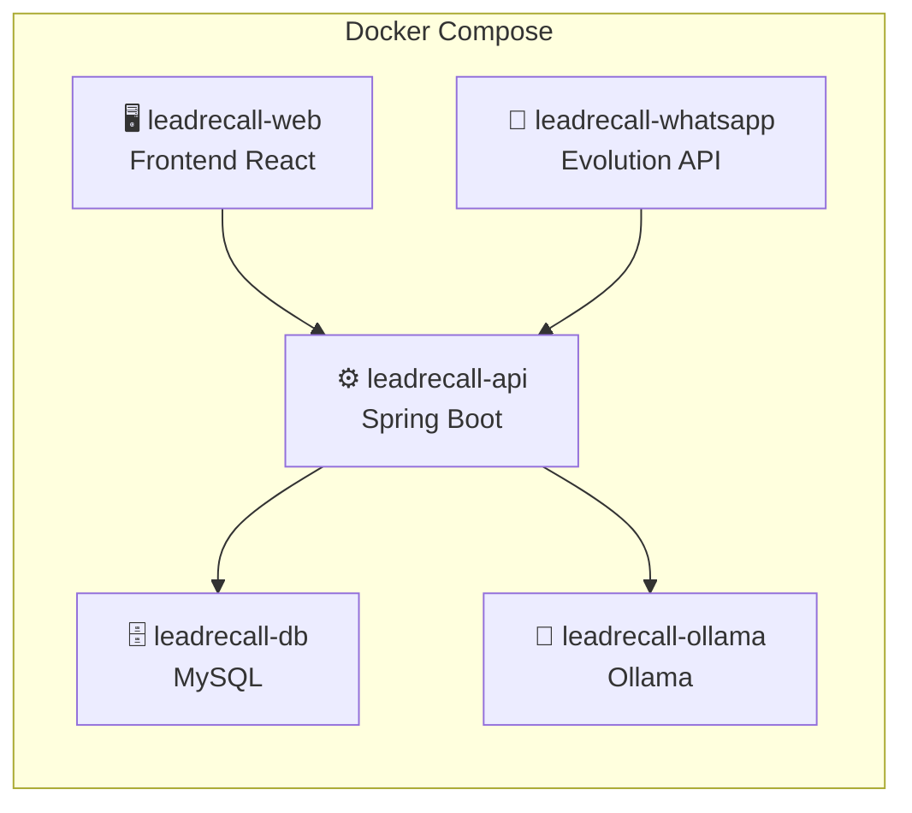
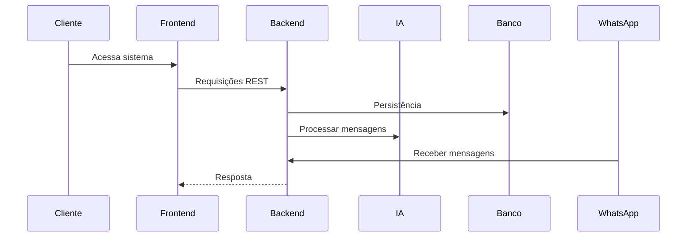
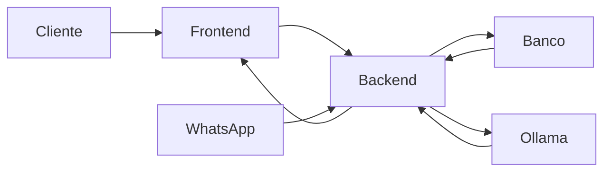

# Containers Docker

## Visão Geral

O Lead Recall AI é implantado utilizando **Docker Compose**, onde cada serviço da plataforma é executado em um container independente.

Essa arquitetura proporciona:

- Isolamento entre serviços;
- Facilidade de implantação;
- Padronização dos ambientes;
- Escalabilidade;
- Facilidade de manutenção;
- Independência entre componentes.

---

# Arquitetura Geral



---

# Containers

## leadrecall-web

### Responsabilidade

Interface Web utilizada pelos usuários da plataforma.

### Tecnologias

- React
- Vite
- TailwindCSS
- Axios

### Comunicação

Consome exclusivamente a API REST do Backend.

---

## leadrecall-api

### Responsabilidade

Container principal da aplicação.

Centraliza toda a lógica de negócio da plataforma.

### Tecnologias

- Java
- Spring Boot
- Spring Security
- JPA / Hibernate

### Responsabilidades

- Autenticação
- Gestão de usuários
- Gestão de empresas
- Gestão de Leads
- Gestão de Estoque
- Motor de Matching
- Orquestrador de Eventos
- Processadores de Eventos
- Geração de Oportunidades
- Notificações
- Integrações
- Comunicação com IA
- Comunicação com Banco de Dados

---

## leadrecall-db

### Responsabilidade

Armazenamento persistente dos dados.

### Tecnologia

- MySQL

### Armazena

- Usuários
- Empresas
- Leads
- Mensagens
- Veículos
- Oportunidades
- Eventos
- Configurações
- Integrações
- Notificações

---

## leadrecall-ollama

### Responsabilidade

Execução do modelo de Inteligência Artificial local.

### Tecnologia

- Ollama

### Responsabilidades

- Interpretar mensagens
- Identificar intenção de compra
- Extrair informações comerciais
- Auxiliar no enriquecimento dos Leads

Toda comunicação ocorre via API REST.

---

## leadrecall-whatsapp

### Responsabilidade

Integração com WhatsApp.

### Tecnologia

- Evolution API

### Responsabilidades

- Receber mensagens
- Enviar mensagens (futuro)
- Gerenciar sessões
- Encaminhar eventos ao Backend

---

# Comunicação entre Containers



---

# Organização Interna do Backend

O Backend concentra diversos módulos responsáveis pelas regras de negócio da plataforma.

```text
Backend API

├── Autenticação
├── Empresas
├── Usuários
├── Leads
├── Estoque
├── Mensagens
├── Integrações
├── Orquestrador de Eventos
├── Processadores de Eventos
├── Motor de Matching
├── Geração de Oportunidades
├── Notificações
└── IA
```

Todos esses módulos são executados dentro do mesmo container (`leadrecall-api`) e se comunicam internamente por chamadas de métodos e publicação de eventos.

---

# Fluxo entre Containers



---

# Docker Compose

O ambiente do MVP é composto pelos seguintes containers:

| Container | Responsabilidade |
|------------|------------------|
| leadrecall-web | Frontend React |
| leadrecall-api | Backend Spring Boot |
| leadrecall-db | Banco MySQL |
| leadrecall-ollama | Serviço de IA Local |
| leadrecall-whatsapp | Evolution API |

---

# Benefícios da Arquitetura

- Containers independentes;
- Implantação simplificada via Docker Compose;
- Escalabilidade por serviço;
- Atualização independente dos componentes;
- Isolamento de dependências;
- Facilidade para desenvolvimento e homologação;
- Preparada para migração futura para Kubernetes.