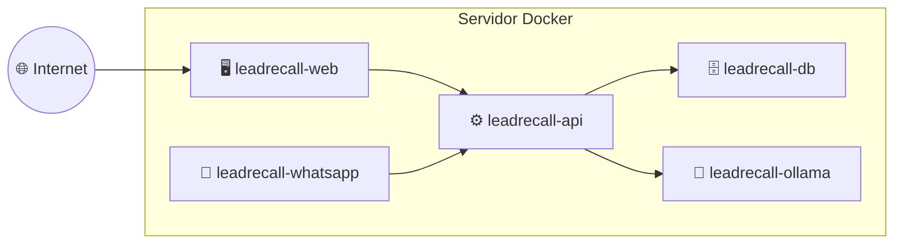
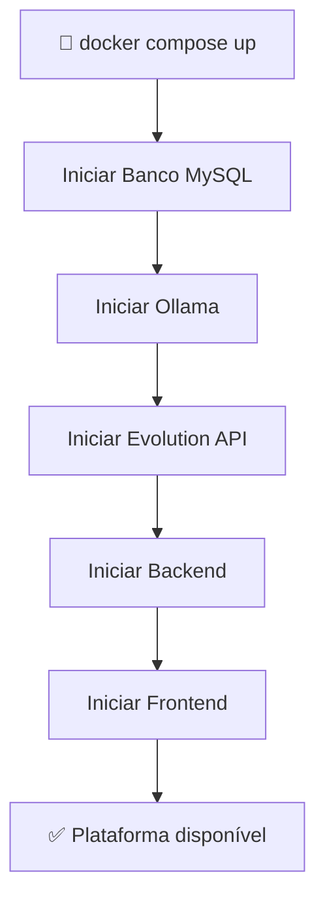
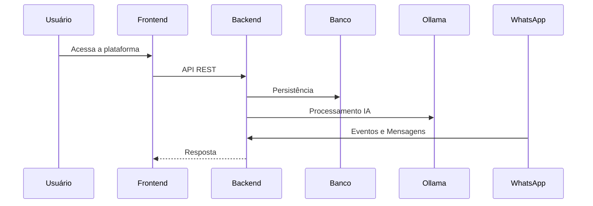

# Deployment

## Visão Geral

O Lead Recall AI é distribuído utilizando **Docker Compose**, onde cada serviço da plataforma é executado em um container independente.

A implantação foi projetada para ser simples, reproduzível e consistente entre os ambientes de desenvolvimento, homologação e produção.

---

# Arquitetura de Implantação



---

# Containers Implantados

| Container | Responsabilidade |
|------------|------------------|
| leadrecall-web | Interface Web (React) |
| leadrecall-api | Backend Spring Boot |
| leadrecall-db | Banco de Dados MySQL |
| leadrecall-ollama | Serviço de Inteligência Artificial |
| leadrecall-whatsapp | Evolution API |

---

# Processo de Inicialização

Durante a inicialização do ambiente, o Docker Compose executa os containers necessários para o funcionamento da plataforma.



---

# Fluxo de Comunicação



---

# Dependências

| Serviço | Dependências |
|----------|--------------|
| Frontend | Backend |
| Backend | Banco de Dados, Ollama, Evolution API |
| Ollama | Nenhuma |
| Banco | Nenhuma |
| Evolution API | Nenhuma |

---

# Rede Docker

Todos os containers compartilham uma mesma rede Docker privada.

```text
Docker Network

├── leadrecall-web
├── leadrecall-api
├── leadrecall-db
├── leadrecall-ollama
└── leadrecall-whatsapp
```

A comunicação entre os serviços ocorre pelos nomes dos próprios containers, dispensando configurações de IP fixo.

---

# Persistência

Os dados persistentes devem ser armazenados em volumes Docker.

| Serviço | Dados Persistidos |
|----------|-------------------|
| MySQL | Banco de Dados |
| Ollama | Modelos LLM |
| Evolution API | Sessões do WhatsApp |

O Frontend e o Backend são reconstruídos a partir das imagens e não necessitam de armazenamento persistente.

---

# Ambientes

A arquitetura suporta diferentes ambientes apenas alterando as configurações.

- Desenvolvimento
- Homologação
- Produção

Cada ambiente pode possuir:

- Banco de dados próprio;
- Variáveis de ambiente específicas;
- Credenciais independentes;
- Endpoints distintos.

---

# Variáveis de Ambiente

As configurações da aplicação devem ser fornecidas por variáveis de ambiente.

Exemplos:

- Credenciais do banco de dados;
- URL da Evolution API;
- URL do Ollama;
- Chaves JWT;
- Configurações de CORS;
- Portas dos serviços.

---

# Escalabilidade

A arquitetura foi projetada para evolução gradual.

No MVP:

- Docker Compose;
- Um container por serviço.

Evoluções futuras:

- Kubernetes;
- Balanceamento de carga;
- Auto Scaling;
- Banco de dados replicado;
- Filas de mensageria (Kafka ou RabbitMQ);
- Observabilidade centralizada.

---

# Benefícios da Implantação

- Implantação simples e padronizada;
- Isolamento entre serviços;
- Atualizações independentes;
- Facilidade de manutenção;
- Portabilidade entre ambientes;
- Preparada para crescimento da plataforma.