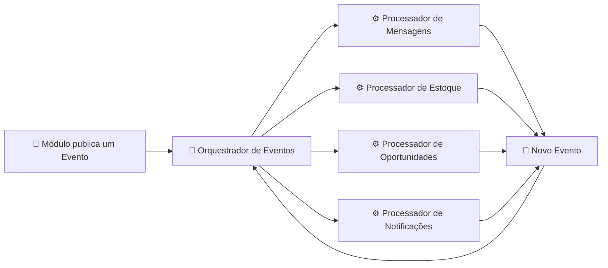
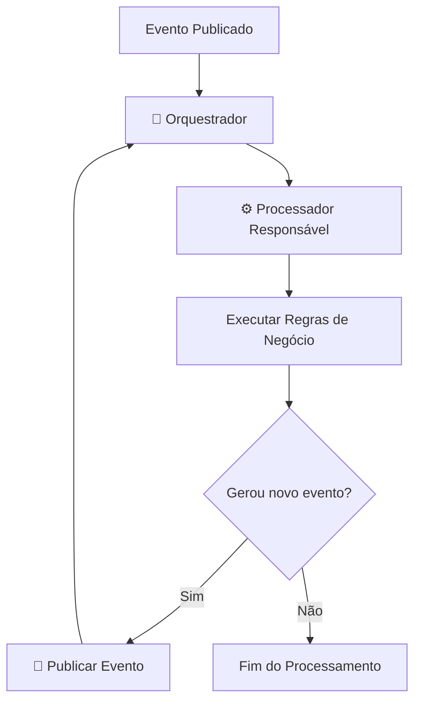

# Event-Driven Architecture

## Visão Geral

O Lead Recall AI foi concebido utilizando uma **Arquitetura Orientada a Eventos (Event-Driven Architecture - EDA)**. Nesse modelo, os módulos da plataforma não se comunicam diretamente entre si. Em vez disso, cada ação relevante gera um evento que é encaminhado ao **Orquestrador de Eventos**, responsável por direcionar o processamento ao módulo adequado.

Essa abordagem reduz o acoplamento entre os componentes, facilita a evolução da plataforma e permite adicionar novos fluxos de processamento sem impactar funcionalidades já existentes.

---

# Arquitetura Geral



---

# Funcionamento

Todo processamento da plataforma segue o mesmo ciclo:

1. Um módulo executa alguma operação.
2. Essa operação gera um evento.
3. O evento é enviado ao Orquestrador de Eventos.
4. O Orquestrador identifica o tipo do evento.
5. O evento é encaminhado ao Processador responsável.
6. O Processador executa as regras de negócio.
7. Caso necessário, um novo evento é publicado.
8. O ciclo continua até que não existam novos eventos a serem processados.

---

# Fluxo Genérico



---

# Componentes

## Orquestrador de Eventos

Responsável por receber todos os eventos publicados na plataforma e encaminhá-los ao processador adequado.

### Responsabilidades

- Receber eventos internos e externos;
- Identificar o tipo do evento;
- Localizar o processador responsável;
- Encaminhar o evento para processamento;
- Evitar duplicidade de processamento;
- Registrar histórico dos eventos;
- Permitir expansão de novos tipos de eventos.

O Orquestrador **não executa regras de negócio**.

---

## Processadores de Eventos

Cada Processador é responsável por um domínio específico da aplicação.

Sua responsabilidade é executar a lógica de negócio referente ao evento recebido.

Exemplos:

- Processador de Mensagens
- Processador de Estoque
- Processador de Oportunidades
- Processador de Notificações

Todos seguem o mesmo padrão:

```text
Receber Evento
      ↓
Executar regra de negócio
      ↓
Atualizar dados
      ↓
Publicar novo evento (quando necessário)
```

---

# Eventos do MVP

| Evento | Publicado por | Consumido por |
|---------|---------------|---------------|
| MessageReceivedEvent | API | Processador de Mensagens |
| LeadUpdatedEvent | Processador de Mensagens | Motor de Matching |
| StockUpdatedEvent | API / Estoque | Processador de Estoque |
| InventoryUpdatedEvent | Processador de Estoque | Motor de Matching |
| OpportunityFoundEvent | Motor de Matching | Geração de Oportunidades |
| OpportunityCreatedEvent | Geração de Oportunidades | Processador de Notificações |

---

# Exemplo de Encadeamento

```text
Nova Mensagem
      │
      ▼
MessageReceivedEvent
      │
      ▼
Processador de Mensagens
      │
      ▼
LeadUpdatedEvent
      │
      ▼
Motor de Matching
      │
      ▼
OpportunityFoundEvent
      │
      ▼
Geração de Oportunidades
      │
      ▼
OpportunityCreatedEvent
      │
      ▼
Processador de Notificações
```

---

# Benefícios da Arquitetura

- Baixo acoplamento entre módulos.
- Alta coesão das responsabilidades.
- Facilidade para adicionar novos eventos.
- Facilidade para adicionar novos processadores.
- Fluxos independentes e reutilizáveis.
- Maior facilidade de manutenção.
- Escalabilidade horizontal.
- Preparada para mensageria (Kafka, RabbitMQ, AWS SQS etc.).
- Facilidade de auditoria através do histórico de eventos.

---

# Fluxos Utilizando Eventos

Os fluxos específicos implementados pela plataforma encontram-se documentados separadamente:

- `flows/message-processing.md`
- `flows/inventory-update.md`

Novos fluxos poderão ser adicionados futuramente mantendo a mesma arquitetura orientada a eventos.