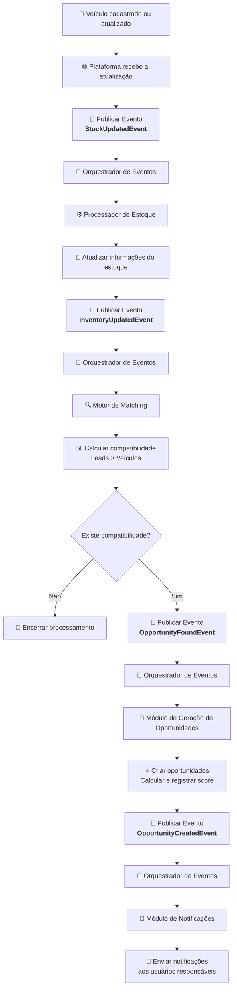

# Fluxo de Atualização de Estoque

## Objetivo

Processar automaticamente alterações no estoque de veículos e identificar novas oportunidades comerciais para leads compatíveis por meio da arquitetura orientada a eventos.

---

## Fluxo de Negócio

1. Um veículo é cadastrado ou atualizado no estoque.
2. A plataforma registra um novo evento de atualização de estoque.
3. O Orquestrador de Eventos identifica o tipo do evento e encaminha seu processamento ao Processador de Estoque.
4. O Processador de Estoque atualiza as informações do estoque.
5. Após a atualização, um novo evento é publicado indicando que o estoque foi alterado.
6. O Orquestrador de Eventos recebe o evento e aciona o Motor de Matching.
7. O Motor de Matching calcula a compatibilidade entre os leads elegíveis e os veículos disponíveis.
8. Quando houver compatibilidade elegível, um evento de oportunidade identificada é publicado.
9. O Orquestrador de Eventos encaminha o evento ao módulo de Geração de Oportunidades.
10. Uma ou mais oportunidades são criadas automaticamente.
11. O score de compatibilidade é calculado e registrado.
12. Um evento de oportunidade criada é publicado.
13. O Orquestrador de Eventos aciona o módulo de Notificações.
14. Os usuários responsáveis recebem as notificações correspondentes.

---

## Eventos Utilizados

| Evento | Descrição |
|----------|----------|
| StockUpdatedEvent | Indica que um veículo foi cadastrado ou atualizado. |
| InventoryUpdatedEvent | Indica que o estoque foi atualizado com sucesso. |
| OpportunityFoundEvent | Indica que o Motor de Matching encontrou uma oportunidade elegível. |
| OpportunityCreatedEvent | Indica que uma oportunidade foi criada com sucesso. |

---

## Diagrama

---

## Componentes Envolvidos

### Processador de Estoque
Responsável por atualizar os dados do estoque e publicar eventos relacionados às alterações realizadas.

### Orquestrador de Eventos
Responsável por receber eventos e encaminhá-los ao módulo ou processador apropriado.

### Motor de Matching
Responsável por calcular a compatibilidade entre leads e veículos disponíveis.

### Módulo de Geração de Oportunidades
Responsável pela criação automática das oportunidades comerciais identificadas.

### Módulo de Notificações
Responsável por comunicar os usuários sobre novas oportunidades geradas.

---

## Regras de Negócio Relacionadas

- RN04 — Sempre que um veículo for cadastrado ou atualizado no estoque, uma nova execução do Motor de Matching deverá ser disparada.
- RN05 — O Motor de Matching somente poderá ser executado em resposta a eventos que alterem a compatibilidade entre leads e veículos.
- RN07 — Uma oportunidade somente poderá ser criada quando existir compatibilidade entre um lead e um veículo disponível.
- RN09 — O sistema não deverá criar oportunidades duplicadas para o mesmo lead e veículo enquanto existir uma oportunidade ativa.

---

## Observações

Este fluxo segue o padrão de arquitetura orientada a eventos adotado pela plataforma, onde os módulos não se comunicam diretamente entre si. Toda a comunicação ocorre por meio da publicação e consumo de eventos, garantindo baixo acoplamento e facilitando a expansão futura do sistema.