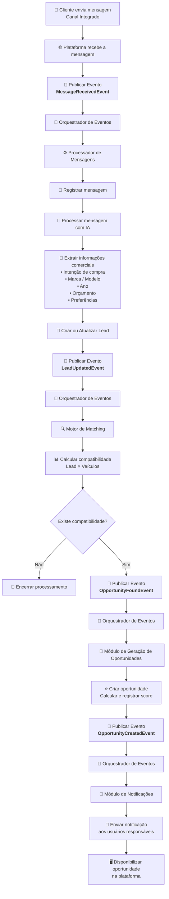

# Fluxo de Processamento de Mensagens

## Visão Geral

Este fluxo representa o processamento completo de uma nova mensagem recebida pela plataforma, desde sua entrada por um canal integrado até a geração automática de uma oportunidade comercial e o envio de notificações aos usuários responsáveis.

A arquitetura segue o modelo **orientado a eventos (Event-Driven Architecture)**, onde cada etapa publica novos eventos consumidos pelo Orquestrador de Eventos, promovendo desacoplamento entre os módulos e facilitando a expansão da plataforma.

## Eventos Envolvidos

| Evento | Descrição |
|---------|-----------|
| **MessageReceivedEvent** | Disparado quando uma nova mensagem é recebida por um canal integrado. |
| **LeadUpdatedEvent** | Publicado após a criação ou atualização das informações do lead. |
| **OpportunityFoundEvent** | Publicado pelo Motor de Matching quando identifica um veículo compatível. |
| **OpportunityCreatedEvent** | Publicado após a criação da oportunidade comercial. |

## Fluxo

## Sequência do Processamento

1. O cliente envia uma mensagem por um canal integrado.
2. A plataforma recebe a mensagem e publica o evento **MessageReceivedEvent**.
3. O Orquestrador de Eventos identifica o tipo do evento e o encaminha ao **Processador de Mensagens**.
4. O Processador de Mensagens registra a mensagem no banco de dados.
5. A mensagem é enviada ao serviço de Inteligência Artificial para interpretação.
6. A IA extrai informações comerciais relevantes, como intenção de compra, veículo de interesse, orçamento e preferências.
7. O lead é criado ou atualizado automaticamente com os dados extraídos.
8. O Processador de Mensagens publica o evento **LeadUpdatedEvent**.
9. O Orquestrador de Eventos recebe o novo evento e aciona o **Motor de Matching**.
10. O Motor de Matching calcula o índice de compatibilidade entre o lead e os veículos disponíveis.
11. Caso exista compatibilidade elegível, o Motor de Matching publica o evento **OpportunityFoundEvent**.
12. O Orquestrador encaminha esse evento ao **Módulo de Geração de Oportunidades**.
13. Uma oportunidade comercial é criada automaticamente, seu score é calculado e registrado.
14. O módulo publica o evento **OpportunityCreatedEvent**.
15. O Orquestrador recebe o novo evento e aciona o **Módulo de Notificações**.
16. Os usuários responsáveis recebem a notificação da nova oportunidade.
17. A oportunidade passa a ficar disponível para consulta e acompanhamento na plataforma.

## Componentes Envolvidos

- Plataforma/API
- Orquestrador de Eventos
- Processador de Mensagens
- Serviço de Inteligência Artificial (Ollama)
- Gestão de Leads
- Motor de Matching
- Módulo de Geração de Oportunidades
- Módulo de Notificações
- Banco de Dados